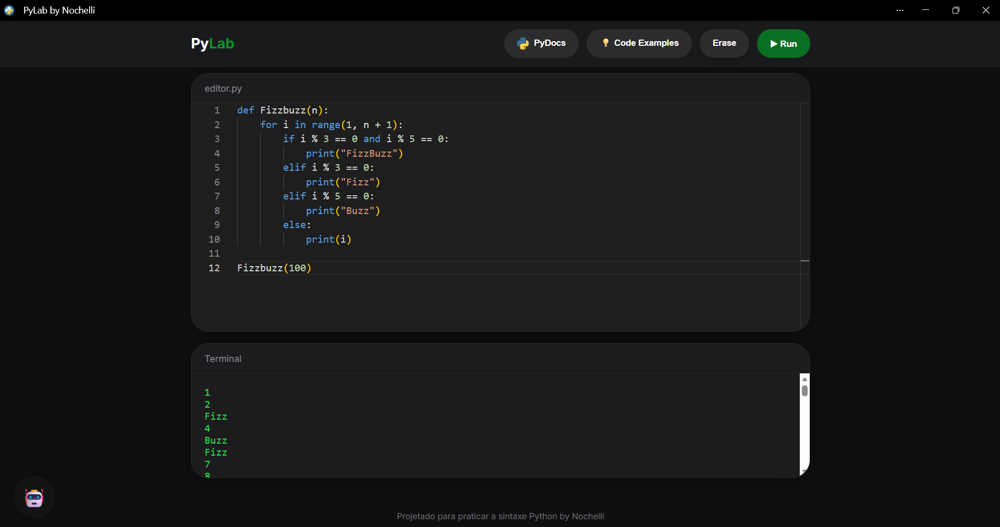
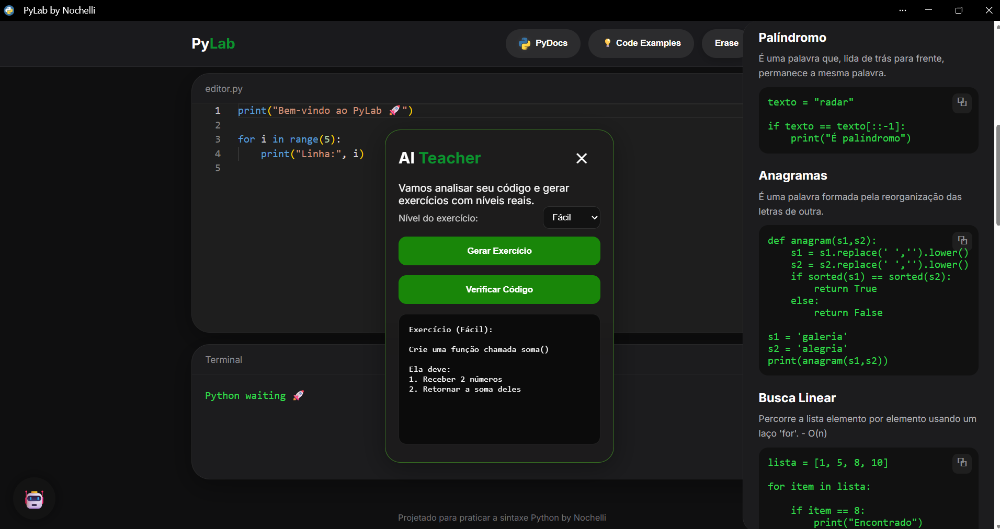

# PYLAB 

PyLab é um ambiente que desenvolvi para estudar Python e ter a facilidade de acessar diretamente no navegador. _(está responsivo, podendo até estudar via mobile)_.

O projeto utiliza Pyodide para executar código Python em tempo real sem necessidade de instalação local e Monaco Editor para oferecer uma experiência semelhante ao VS Code.

O projeto foi desenvolvido utilizando HTML, CSS e JavaScript, com foco em aprendizado, prática de programação e interface moderna.

   

A aplicação possui editor de código integrado, terminal embutido, biblioteca de exemplos prontos, sistema de exercícios, janela flutuante de Professor IA e área de documentação com conceitos fundamentais da linguagem Python, incluindo Programação Orientada a Objetos.

   

_O PyLab também funciona em dispositivos móveis, permitindo estudar Python em qualquer lugar e a qualquer hora diretamente pelo navegador. Além disso, ele pode ser utilizado como PWA, possibilitando o uso como um aplicativo no celular ou computador._

**https://nochelli.github.io/Pylab/**
